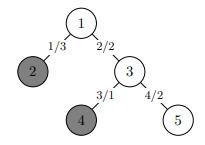
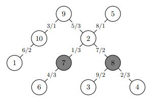

- 题目名：Alpine valley
- 来源：
  - 竞赛：BalticOI
  - 年份：2019
  - 比赛日：Day 1
  - 编号：T3
- 时间限制：3000 ms
- 空间限制：256 MiB
- 类型：传统

## 题目描述

在阿尔卑斯山谷中，有 $N$ 个村庄，编号为 $1 \ldots N$，这些村庄通过 $N-1$ 条边连接起来，形成了一个树型结构。

虽然任意两个村庄间都能相互抵达，但路途花费的时间可能令人难以接受，尤其是当你想要购买一些生活必需品的时候——因为所有村庄中，只有其中 $S$ 个村庄有商店。

今年冬天，由于大雪的原因，情况变得更糟。因此，你需要到达 $E$ 号村庄——那里有连接山区和外界的唯一通道，亦或是在山谷中的商店里购买足够接下来几个月生活的物资。今天早上，你在收音机里听到了所有道路中有一条道路无法通行的消息，但是你并不知道具体是哪一条道路。

你现在想知道你和你的朋友是否可以离开山谷，如果不能离开，则需要知道你们离最近商店的距离。由于你还不知道哪条道路无法通行，并且你的朋友们居住在不同的村庄，因此你需要回答 $Q$ 组询问，每组询问给出一条被封锁的道路和你朋友所在村庄的位置。

## 输入格式

输入第一行包含四个整数 $N,S,Q,E$。其中 $N$ 代表村庄数目，$S$ 代表有商店的村庄的数目，$Q$ 代表你需要回答的询问数，$E$ 代表连接山区和外界的村庄的编号。

接下来 $N-1$ 行，每行包含三个整数 $A,B,W$，代表村庄 $A$ 与村庄 $B$ 之间有一条长度为 $W$ 的道路。

接下来 $S$ 行，每行包含一个整数 $C$，代表 $C$ 号村庄有一个商店。数据保证同一个村庄最多只有一个商店。

最后 $Q$ 行，每行两个整数 $I,R$，询问当 $I$ 号道路（按输入顺序编号）无法通行时，从 $R$ 号村庄出发能否离开山谷，如果不能，则询问其离最近商店的距离。

## 输出格式

输出包含 $Q$ 行，第 $i$ 行输出第 $i$ 组询问的答案。更具体地说，如果能离开山谷，输出 `escaped`；如果不能离开山谷的话，输出 $R$ 号村庄离最近商店的距离；如果既不能离开山谷，也不能到达任意一个商店的话，输出 `oo`。

## 样例

### 样例输入 1

```plain
5 2 3 1
1 2 3
1 3 2
3 4 1
3 5 2
2
4
2 2
2 5
4 5
```

### 样例输出 1

```plain
escaped
3
oo
```

### 样例解释 1

本样例对应下图：



在该图（以及接下来一张图）中，用灰色标记的点为商店所在点，图上的边按照「编号 / 长度」的顺序进行标注。

### 样例输入 2

```plain
10 2 5 4
7 2 3
4 8 3
9 10 1
6 7 3
9 2 3
10 1 2
8 2 2
5 2 1
3 8 2
8
7
2 1
1 5
8 4
6 2
7 7
```

### 样例输出 2

```plain
8
escaped
escaped
escaped
0
```

### 样例解释 2

本样例对应下图：



## 子任务

对于所有数据，均满足：$1 \leq S,E,A,B,C,I,R \leq N$，且 $1 \leq W \leq 10^9$。

各子任务的分值与数据规模如下：

- 子任务 1（9 分）：$1 \leq N \leq 100,1 \leq Q \leq 10000$，且所有道路均满足 $|A-B|=1$；
- 子任务 2（27 分）：$1 \leq N \leq 1000,1 \leq Q \leq 1000$；
- 子任务 3（23 分）：$1 \leq N \leq 10^5,1 \leq Q \leq 10^5$，且 $S=N$；
- 子任务 4（41 分）：$1 \leq N \leq 10^5,1 \leq Q \leq 10^5$。