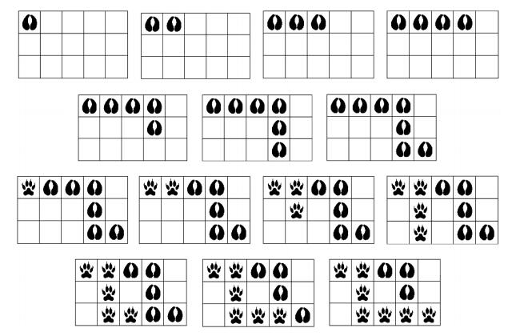

- 题目名：Zoo
- 来源：
  - 竞赛：COCI
  - 赛季：2019-2020
  - 场次：Contest #1
  - 编号：T5
- 总分：110
- 时间限制：2000 ms
- 空间限制：512 MiB
- 类型：传统

## 题目描述

一个圣诞节的晚上，一个人离开了他的家，到对面的公园去散步。

不幸的是，一个怪物的出现打破了夜晚的宁静。这个怪物突然出现在这个人的面前，但这个人用一声咆哮，将这个怪物吓跑了。

这个人不知道，他的咆哮打扰到了附近动物园的动物们。动物园里的老虎和牛非常恼火，它们决定逃离动物园，找到一个安静的地方度过剩下的夜晚。

在逃跑的时候，动物们需要穿越一个 $R \times C$ 的矩形区域。所有动物需要从左上角的方格进入该区域，从右下角的方格离开该区域。为了不引起注意，所有动物将一个接一个通过该区域。动物们每步可以向上下左右四个方向移动，但它们不一定沿着最短的路径行进，同一个动物也可能多次经过同一个方格。由于地面被雪覆盖，动物经过时会留下脚印。如果一个方格里已经留下了足迹，另外一个动物通过这个方格时，会擦除原来留下的足迹，留下新的足迹。

您现在需要根据整个矩形区域内留下足迹的情况，算出**至少**有多少只动物逃离了动物园。

## 输入格式

第一行两个整数 $R,C$。

接下来 $R$ 行，每行 $C$ 个字符，描述题目中所述的矩形区域。`T` 代表该格留下了老虎的足迹，`B` 代表该格留下了牛的足迹，`*` 代表该格没有留下任何足迹。

## 输出格式

输出逃离动物园的动物数量的**最小值**。

## 样例

### 样例输入 1
```plain
4 4
TT*T
*TTT
***T
***T
```

### 样例输出 1
```plain
1
```

### 样例输入 2
```plain
3 5
TTBB*
*T*B*
*TTTT
```

### 样例输出 2
```plain
2
```

### 样例解释 2
本样例对应下图：



### 样例输入 3
```plain
7 5
BT***
BTBBB
BTTTB
BBT*B
BBT*B
BBT**
*BBBB
```

### 样例输出 3
```plain
3
```

## 子任务

- 子任务 1（45 分）：$2 \leq R,C \leq 100$；
- 子任务 2（65 分）：$2 \leq R,C \leq 1000$。